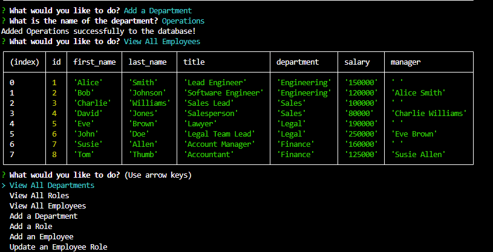

# SQL Employee Tracker


## Description
Managing employee data effectively is crucial for any organization’s operational success. To simplify this process, this week’s UT Austin Coding Boot Camp challenge involved building an employee tracker command-line application from scratch using Node.js, Inquirer, and PostgreSQL. This application allows users, most notably business managers, to manage a company’s employee database more easily and efficiently, which helps with business organization and planning.

As a powerful command-line application, the SQL Employee Tracker streamlines the efficient management of a company’s employee database using Node.js, Inquirer, and PostgreSQL. This application offers functionalities to view, add, update, and delete departments, roles, and employees, as well as to perform additional operations such as viewing employees by manager or department and calculating departmental budgets. Additionally, this application simplifies the process of adding new entries or updating employees’ roles through intuitive prompts powered by Inquirer. By combining Node.js for runtime execution, Inquirer for user interaction, and PostgreSQL for database connectivity and data storage, the SQL Employee Tracker application offers intuitive commands and structured views to handle the complexities of employee management seamlessly.

The motivation behind building the SQL Employee Tracker application stemmed from the need to enhance organizational efficiency and streamline administrative tasks related to workforce management. Traditional methods of managing employee data often involve manual updates and disparate systems, leading to inefficiencies and potential errors. This application seeks to automate and centralize these processes, enabling users to focus more on strategic decision making rather than mundane administrative tasks.

Offering a comprehensive suite of functionalities, the SQL Employee Tracker empowers users, especially business owners and administrators, to efficiently organize, update, and retrieve critical information about departments, roles, and employees within their organization. Overall, this application combines reliability with scalability, catering to businesses of various sizes and organizational structures. By leveraging the strengths of Node.js, Inquirer, and PostgreSQL, this application provides a functional and user-friendly employee management system which simplifies database management while empowering businesses to streamline their operations and make informed decisions.


## Table of Contents
- [SQL Employee Tracker](#sql-employee-tracker)
  - [Description](#description)
  - [Table of Contents](#table-of-contents)
  - [User Story](#user-story)
  - [Acceptance Criteria](#acceptance-criteria)
  - [Technologies Used](#technologies-used)
  - [Features](#features)
  - [Installation](#installation)
  - [Usage](#usage)
    - [Screenshots:](#screenshots)
  - [Tests](#tests)
  - [Links \*\*\*](#links-)
  - [Credits](#credits)
  - [License](#license)
  - [Questions](#questions)


## User Story
```md
AS A business owner
I WANT to be able to view and manage the departments, roles, and employees in my company
SO THAT I can organize and plan my business
```

## Acceptance Criteria
```md
GIVEN a command-line application that accepts user input
WHEN I start the application
THEN I am presented with the following options: view all departments, view all roles, view all employees, add a department, add a role, add an employee, and update an employee role
WHEN I choose to view all departments
THEN I am presented with a formatted table showing department names and department ids
WHEN I choose to view all roles
THEN I am presented with the job title, role id, the department that role belongs to, and the salary for that role
WHEN I choose to view all employees
THEN I am presented with a formatted table showing employee data, including employee ids, first names, last names, job titles, departments, salaries, and managers that the employees report to
WHEN I choose to add a department
THEN I am prompted to enter the name of the department and that department is added to the database
WHEN I choose to add a role
THEN I am prompted to enter the name, salary, and department for the role and that role is added to the database
WHEN I choose to add an employee
THEN I am prompted to enter the employee’s first name, last name, role, and manager, and that employee is added to the database
WHEN I choose to update an employee role
THEN I am prompted to select an employee to update and their new role and this information is updated in the database
```

## Technologies Used
-	Node.js
-	Inquirer
-	PostgreSQL


## Features
- **Comprehensive Views**: Provides detailed and structured views of departments, roles, and employees in a tabular format.
- **Efficient Data Entry**: Allows for easy addition of new departments, roles, and employees with guided prompts.
- **Role Updates**: Enables seamless updates of employee roles to reflect organizational changes.
- **User-Friendly Interface**: Offers an intuitive command-line interface (CLI) powered by Inquirer.js for effortless interaction.


## Installation
To install the SQL Employee Tracker, follow the following steps:
1.	Clone the repository to your local machine: `git clone https://github.com/vaughanknouse/SQL-employee-tracker.git`.
2.	Ensure that the current version of Node.js is installed. 
3.	Open the cloned repository in a CLI, such as Visual Studio Code.
4.	Navigate to the project directory in your terminal. 
5.	Initialize a project with `package.json` by typing `npm init -y` in the terminal.
6.	Install npm’s `inquirer` version 8.2.4 package by typing `npm i inquirer@8.2.4` in the terminal.
7.	Install npm’s `pg` package by typing `npm install pg` in the terminal.
8.	Install any other necessary dependencies by typing `npm i` in the command line to ensure that the `node-modules` folder is operating on your local device.


## Usage
To use the SQL Employee Tracker, follow the following steps:
1.	Ensure that PostgreSQL is installed on your computer. 
2.	Open the Postgres Shell by typing the command `psql -U postgres` in the terminal.
3.	Enter your user database password.
4.	Create the `company_db` database by typing the command `\i db/schema.sql` in the terminal.
5.	Seed the `company_db` database with some employee information by typing the command `\i db/seeds.sql` in the terminal.
6.	Once your PostgreSQL database is active, navigate to the project directory and run the application by typing `node index.js` in the terminal.
7.	Select your desired action from the command line prompts using the ‘UP’ and ‘DOWN’ arrow keys on your keyboard in order to update the company’s employee database.


### Screenshots:
The following screenshot demonstrates the application's functionality and appearance:

**Image of the application being run in the command line showing user input prompts:**




## Tests
There is no unit testing written for this application.


## Links ***
GitHub Repository: https://github.com/vaughanknouse/SQL-employee-tracker

Walkthrough Video Link: ***


## Credits 
Used the following sources as tutorials and guidelines:

PostgreSQL Shell Documentation: https://www.postgresql.org/docs/current/app-psql.html

Node.js `pg` Package: https://www.npmjs.com/package/pg

ChatGPT: https://chatgpt.com/?oai-dm=1

Also utilized the Xpert Learning Assistant for some portions of my code:
https://bootcampspot.instructure.com/courses/5293/external_tools/313


## License
This project is licensed under the MIT license. For more information, please visit [this link](https://opensource.org/licenses/MIT).


## Questions
For any questions or feedback, please contact me via email at vaughanknouse@gmail.com.

Additionally, you can find me on GitHub at [vaughanknouse](https://github.com/vaughanknouse).
